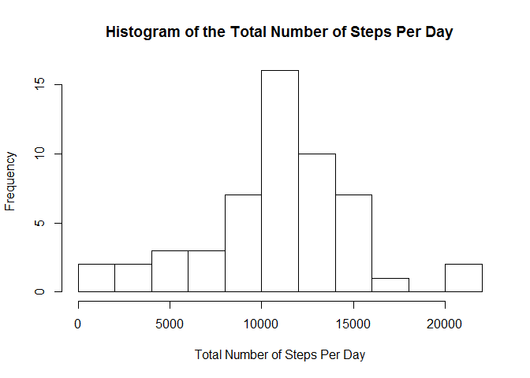
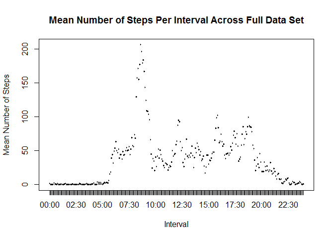
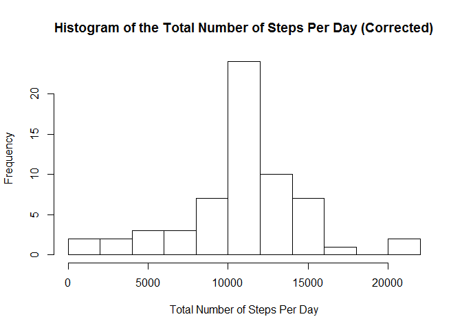
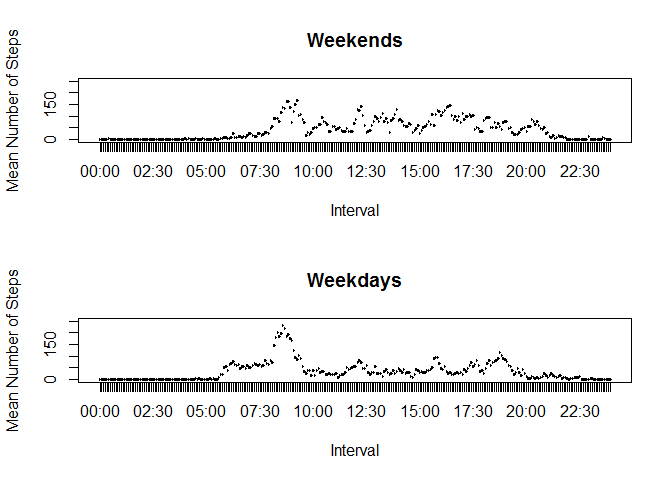

# Reproducible Research 1
Aqeel Padaria  
14 July 2016  


## Course Project 1

This is my submission for Course Project 1 in the Reproducible Research course.

For the plots in this project, I have used the base plotting system.

## Loading and Preprocessing

We begin by reading in the data and storing it as a data frame. We also make several transformations to the data.

For instance, we convert the date and interval variables to a more workable format.


```r
activity <- read.csv("activity.csv")
activity$date <- as.Date(activity$date)
activity$interval <- substr(as.POSIXct(sprintf("%04.0f", activity$interval), format='%H%M'), 12, 16)
```

## What is the mean total number of steps taken per day?

This is our first question. What is the mean total number of steps taken per day? In order to answer this, we must transform our data, since we first need to know the total number of steps per day for all days in order to get the mean.


```r
dates <- data.frame(date = unique(activity$date))
agg <- aggregate(steps ~ date, data=activity, sum)
spd <- merge(dates,agg,all=TRUE)
```

We draw out all the dates that measurements were taken on, and then we calculate the total number of steps per date and merge the two.

Usually, we could be content with the second line of code, but there are several missing values here that result in the 'agg' data set missing a number of dates. As such, we have extracted the dates separately and merged the two data sets. Now, we don't actually handle the missing values at this time, and as such this step is rendered useless, but it can be useful to hold on to values in certain cases.

A histogram is a diagram that is used to measure variable frequency. It looks similar to a bar plot at first glance, but is very different under the surface - a bar plot is divided into portions by categorical variables and is used for comparisons, while a histogram is divided by quantitative variables and is used to show distributions and frequencies.

Right now, we're interested in a histogram. Specifically, one that shows the distribution of the number of steps per day.


```r
hist(spd$steps, breaks=10, xlab = "Total Number of Steps Per Day", main = "Histogram of the Total Number of Steps Per Day")
```

<!-- -->

So it seems that most days have 8000+ steps taken.

Now that we have a visual idea of how this variable is distributed, let's take a look at the mean and median of the total number of steps.


```r
mean(spd$steps, na.rm=TRUE)
```

```
## [1] 10766.19
```

```r
median(spd$steps, na.rm=TRUE)
```

```
## [1] 10765
```

This tells us that the mean total number of steps taken per day is 10766.19. Looking at the histogram, this seems reasonable.

## What is the average daily activity pattern?

In the previous segment, we looked at the data divided by date - now we look at it divided by time. The question asks us about the mean of the activity pattern as it varies by the time of the day, which is represented by the interval variable.

Our first step, therefore, must be to calculate the mean number of steps per time interval, just as we did for date earlier.


```r
intervals <- data.frame(interval = unique(activity$interval))
agg2 <- aggregate(steps ~ interval, data=activity, mean)
spi <- merge(intervals, agg2, all=TRUE)
```

Then we plot the calculated mean across all intervals to gauge the daily pattern.


```r
plot(spi$interval, spi$steps, main = "Mean Number of Steps Per Interval Across Full Data Set", xlab = "Interval", ylab = "Mean Number of Steps")
```

<!-- -->

A glance at the data indicates low activity patterns early and late in the day, high activity around 8 AM and moderate activity otherwise. This is consistent with most people's sleep patterns, and so this plot seems reasonable.

The secondary question in this section asks: what is the interval that, on average, contains the most steps? This can easily be solved.


```r
print(spi[spi$steps == max(spi$steps),1], max.levels = 0)
```

```
## [1] 08:35
```

The interval with the most activity is at 08:35 AM, which is consistent with the plot above.

## Inputting missing values

This data set does contain many missing values, which could be throwing off our measurements. As pointed out above, there are entire *days* with invalid entries. As such, we should find a way to fill in these missing values.

First, let's take a look at the number of missing values.


```r
sum(is.na(activity$steps))
```

```
## [1] 2304
```

```r
sum(is.na(activity$steps))*100/nrow(activity)
```

```
## [1] 13.11475
```

That's 13% of all values. Not so many as to render the entire data set worthless, but still worth our effort to plug the gaps.

We've seen that activity levels vary wildly based on time of day, and as pointed out above entire days don't even have any values, so inputting the mean for that day is probably not a good idea. On the other hand, activity levels likely don't vary much by day, so using the intervals as guides could be better.


```r
activity2 <- activity

for(i in 1:nrow(activity))
  {
  if(is.na(activity$steps[i]))
    {
    activity2$steps[i] <- round(spi[spi$interval == activity$interval[i],2])
    }
}
```

We store the updated values into a new data set, so the old one is still around if we need it.

Now let's see how this changes the analyses we ran earlier.


```r
dates <- data.frame(date = unique(activity2$date))
agg <- aggregate(steps ~ date, data=activity2, sum)
spd <- merge(dates,agg,all=TRUE)
hist(spd$steps, breaks=10, xlab = "Total Number of Steps Per Day", main = "Histogram of the Total Number of Steps Per Day (Corrected)")
```

<!-- -->

```r
mean(spd$steps, na.rm=TRUE)
```

```
## [1] 10765.64
```

```r
median(spd$steps, na.rm=TRUE)
```

```
## [1] 10762
```

There's... not much change in the mean and median. That's surprising. Or is it? Recall that we used the mean values of the number of steps across intervals to fill in missing values. Given that we didn't introduce any outliers or statistically significant values, is it really surprising that the mean and median have barely changed? We extrapolated from the original data set to fill in the gaps, so we shouldn't expect (or want) those gaps to have any major statistical impact.

There is a significant change in the histogram, if one looks at the axes. The greatest column, 10,000-12,000, seems to have grown immensely. Again, this is explained by the simple fact that we gave the missing values mean values. Since the average number of steps per day was already in this column, the addition of over 2,000 new values in the per-interval step, each of which would add together to give a daily total quite near the mean, easily explains the sharp increase in this column's height.

## Are there differences in activity patterns between weekdays and weekends?

Given that many people have holidays on the weekend, it's possible that those days may show some different activity patterns. Let's investigate.

First, we should designate each reading as being on a weekday or a weekend.


```r
activity2$weekday <- sapply(activity2$date, function(x) ifelse(weekdays(x) %in% c("Saturday","Sunday"),0,1))
```

First, we'll check the activity patterns for the weekend.


```r
dat <- subset(activity2, weekday == 0)
intervalse <- data.frame(interval = unique(dat$interval))
agg2e <- aggregate(steps ~ interval, data=dat, mean)
spie <- merge(intervalse, agg2e, all=TRUE)
```

Then, we'll check the activity patterns for the weekday.


```r
dat <- subset(activity2, weekday == 1)
intervalsd <- data.frame(interval = unique(dat$interval))
agg2d <- aggregate(steps ~ interval, data=dat, mean)
spid <- merge(intervalsd, agg2d, all=TRUE)
```

Finally, we plot the two and see the difference. We also set up the graphics device to display two plots, one for each day type.


```r
par(mfrow=c(2,1))
plot(spie$interval, spie$steps, main = "Weekends", xlab = "Interval", ylab = "Mean Number of Steps", ylim = c(0,250))
plot(spid$interval, spid$steps, main = "Weekdays", xlab = "Interval", ylab = "Mean Number of Steps", ylim  =c(0,250))
```

<!-- -->

The plot shows significant differences in activity levels between weekdays and weekends (which, incidentally, calls into question the validity of our earlier tactic of filling in missing values using the mean of the time interval).

## Conclusion

This concludes the report for this project. Thank you for your time, and I hope you have not had any problems following the code.
